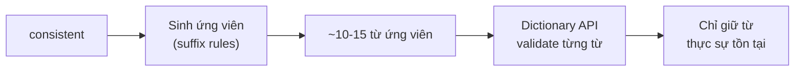

# Phân tích: Suffix Patterns để tìm từ liên quan

## Cách hoạt động



**Bước 1 — Sinh ứng viên:** Áp dụng nhiều suffix rules để tạo ~10-15 từ ứng viên  
**Bước 2 — Validate:** Gọi Dictionary API kiểm tra từng từ → chỉ giữ từ thật

> [!IMPORTANT]
> Độ chính xác **đầu ra** rất cao (~99%) nhờ Dictionary API validation. Vấn đề chính là **coverage** — có thể bỏ sót một số từ liên quan.

## Vị trí các từ loại trong câu

```
  Subject          Verb         Object/Complement
    ↓                ↓              ↓
[NOUN/PRONOUN]  [VERB]    [NOUN / ADJ / ADV]
```

### Noun (Danh từ) — `consistency`, `importance`, `creativity`

| Vị trí | Công thức | Ví dụ |
|--------|-----------|-------|
| **Chủ ngữ** | **N** + V | **Consistency** is important. |
| **Tân ngữ** | V + **N** | I need **consistency**. |
| **Sau giới từ** | prep + **N** | He spoke with **confidence**. |
| **Sau tính từ sở hữu** | his/her/my + **N** | Her **creativity** impressed us. |
| **Sau mạo từ** | a/an/the + **N** | The **importance** of education. |

### Verb (Động từ) — `consist`, `create`, `develop`

| Vị trí | Công thức | Ví dụ |
|--------|-----------|-------|
| **Sau chủ ngữ** | S + **V** | He **creates** art. |
| **Sau trợ động từ** | aux + **V** | She will **develop** a plan. |
| **Sau to** | to + **V** | I want to **improve**. |

### Adjective (Tính từ) — `consistent`, `important`, `creative`

| Vị trí | Công thức | Ví dụ |
|--------|-----------|-------|
| **Trước danh từ** | **Adj** + N | A **consistent** effort. |
| **Sau linking verb** | be/seem/look + **Adj** | She is **creative**. |
| **Sau too/very/so** | very + **Adj** | It's very **important**. |

### Adverb (Trạng từ) — `consistently`, `importantly`, `creatively`

| Vị trí | Công thức | Ví dụ |
|--------|-----------|-------|
| **Trước/sau động từ** | **Adv** + V / V + **Adv** | He **consistently** performs well. |
| **Trước tính từ** | **Adv** + Adj | It's **incredibly** important. |
| **Đầu câu** | **Adv**, S + V | **Importantly**, we must act now. |

### Tổng hợp vị trí — Ví dụ với word family "consistent"

```
consistent (adj)   → a consistent result       (ADJ + N)
consistency (n)    → consistency is key         (N + V)
consistently (adv) → he consistently improves   (ADV + V)
consist (v)        → it consists of parts       (S + V)
```

## Bảng Suffix Patterns

### Adjective → Noun

| Pattern | Ví dụ | Chính xác? |
|---------|-------|:----------:|
| `-ent` → `-ence/-ency` | consistent → consistency ✅ | ⭐⭐⭐ |
| `-ant` → `-ance/-ancy` | important → importance ✅ | ⭐⭐⭐ |
| `-ive` → `-ivity` | creative → creativity ✅ | ⭐⭐⭐ |
| `-ous` → `-osity` | curious → curiosity ✅ | ⭐⭐ |
| `-ful` → `-fulness` | beautiful → beautifulness ❌ (beauty) | ⭐⭐ |
| `-able/-ible` → `-ability/-ibility` | available → availability ✅ | ⭐⭐⭐ |
| `-al` → `-ality` | personal → personality ✅ | ⭐⭐ |

### Adjective → Adverb

| Pattern | Ví dụ | Chính xác? |
|---------|-------|:----------:|
| `+ly` | consistent → consistently ✅ | ⭐⭐⭐ |
| `-le` → `-ly` | simple → simply ✅ | ⭐⭐⭐ |
| `-y` → `-ily` | happy → happily ✅ | ⭐⭐⭐ |
| `-ic` → `-ically` | basic → basically ✅ | ⭐⭐⭐ |

### Noun → Verb

| Pattern | Ví dụ | Chính xác? |
|---------|-------|:----------:|
| `-tion` → `-te` | creation → create ✅ | ⭐⭐⭐ |
| `-ation` → bỏ `-ation` + `e` | exploration → explore ✅ | ⭐⭐⭐ |
| `-ment` → bỏ `-ment` | development → develop ✅ | ⭐⭐⭐ |

### Verb → Noun

| Pattern | Ví dụ | Chính xác? |
|---------|-------|:----------:|
| `-ate` → `-ation` | create → creation ✅ | ⭐⭐⭐ |
| `-ify` → `-ification` | simplify → simplification ✅ | ⭐⭐⭐ |
| `-ize` → `-ization` | organize → organization ✅ | ⭐⭐⭐ |
| `+ment` | develop → development ✅ | ⭐⭐ |

### Prefix Patterns (phủ định)

| Pattern | Ví dụ | Chính xác? |
|---------|-------|:----------:|
| `un-` | happy → unhappy ✅ | ⭐⭐ |
| `in-` | consistent → inconsistent ✅ | ⭐⭐ |

## Ưu và nhược điểm

| | Suffix Patterns + Dictionary API | Gemini AI |
|---|---|---|
| **Tốc độ** | ⚡ Rất nhanh (~1-2s) | 🐌 Chậm (~3-5s) |
| **Giới hạn** | ♾️ Không giới hạn | ❌ Free tier rất ít |
| **Chi phí** | 🆓 Hoàn toàn miễn phí | 💰 Hết free phải trả tiền |
| **Chính xác đầu ra** | ✅ ~99% (nhờ validate) | ✅ ~95% |
| **Coverage** | ⚠️ ~70-80% (có thể bỏ sót) | ✅ ~95% |
| **Từ bất quy tắc** | ❌ Không bắt được | ✅ Bắt được |

### Trường hợp suffix patterns bỏ sót

| Từ gốc | Từ liên quan bị bỏ sót | Lý do |
|---------|------------------------|-------|
| strong | strength | Biến đổi bất quy tắc |
| beautiful | beauty | Gốc từ thay đổi hoàn toàn |
| good | goodness ✅, well ❌ | "well" không theo pattern |
| die | death | Hoàn toàn khác gốc |
| long | length | Biến đổi bất quy tắc |

> [!NOTE]
> Suffix patterns hoạt động tốt nhất với từ **Latin/Greek gốc** (consistent, important, creative...) — chiếm phần lớn từ vựng học thuật. Từ **Germanic gốc** (strong, long, die...) thường có biến đổi bất quy tắc và bị bỏ sót.
